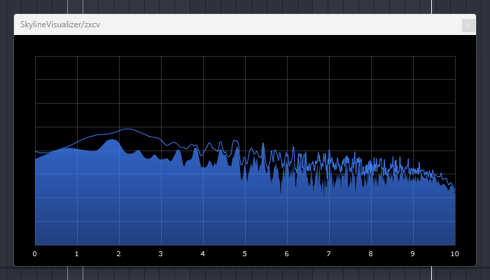

# SkylineVisualizer - VST3 Analyzer Plugin

**Version 1.0.2**
Copyright © 2025 Ezuhazar.

SkylineVisualizer is a simple yet effective visual analysis tool designed for mixing and mastering engineers.

---

---

## 📦 Installation Guide

Please place the plugin file (`SkylineVisualizer.vst3`) into the VST3 directory specific to your operating system.

### Common VST3 Path:
* **Windows:** `C:\Program Files\Common Files\VST3\`

---

### Installation Instructions by Language

#### English

1.  Unzip the package.
2.  Copy the "SkylineVisualizer.vst3" file into the VST3 directory listed above.
3.  Restart your DAW (Ableton Live, Cubase, Studio One, etc.).

#### 日本語

1.  ファイルを解凍してください。
2.  "SkylineVisualizer.vst3" ファイルを、上記の VST3 フォルダにコピーしてください。
3.  DAW (Ableton Live, Cubase, Studio Oneなど) を再起動してください。

#### Deutsch

1.  Entpacken Sie die Datei.
2.  Kopieren Sie die "SkylineVisualizer.vst3" Datei in das oben aufgeführte VST3-Verzeichnis.
3.  Starten Sie Ihre DAW (Ableton Live, Cubase, Studio One usw.) neu.

#### Русский (Russian)

1.  Распакуйте архив.
2.  Скопируйте файл "SkylineVisualizer.vst3" в директорию VST3, указанную выше.
3.  Перезапустите вашу DAW (Ableton Live, Cubase, Studio One и т.д.).

---

## 📝 License

This software is distributed under the **SkylineVisualizer End User License Agreement (EULA)**.
For full terms and conditions, please refer to the included `LICENSE.md` file.

